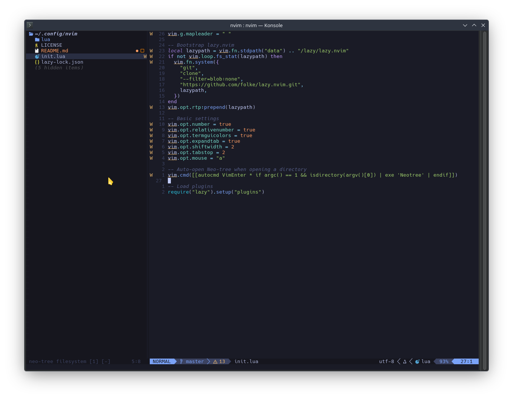

# nvim-config

My personal Neovim configuration for Linux — full-featured IDE setup using lazy.nvim.



## Defaults and Goals
- Keep the setup small and understandable while still covering daily IDE needs.
- Use sensible editing defaults: line numbers, relative numbers, true color, 2-space indentation, and mouse support.
- Favor fast navigation with Neo-tree for project browsing and Telescope for fuzzy finding.
- Keep language support practical with LSP, Treesitter, Mason, and nvim-cmp.
- Preserve a smooth completion workflow by keeping `Tab` for `nvim-cmp` and moving GitHub Copilot accept to `<C-l>`.
- Stick to a clean, consistent UI with Tokyo Night and lualine instead of heavy visual customization.

## Requirements
- Neovim >= 0.9
- Git
- A [Nerd Font](https://www.nerdfonts.com/) for icons
- `ripgrep` for Telescope live grep

## Install
SSH:

```bash
git clone git@github.com:zkm/nvim-config.git ~/.config/nvim
```

HTTPS:

```bash
git clone https://github.com/zkm/nvim-config.git ~/.config/nvim
```

## Quick Start
```bash
nvim
```

On first launch, lazy.nvim will bootstrap itself and install the configured plugins.

Open a file to get syntax highlighting, completion, and LSP features for supported languages.

If you open Neovim with a directory path, Neo-tree opens automatically:

```bash
nvim ~/.config/nvim
```

## Structure
```text
~/.config/nvim/
├── init.lua
├── lazy-lock.json
└── lua/
    └── plugins/
        ├── init.lua
        ├── cmp.lua
        ├── copilot.lua
        ├── lsp.lua
        ├── lualine.lua
        ├── neotree.lua
        ├── telescope.lua
        ├── theme.lua
        └── treesitter.lua
```

## Keymaps
- `Space` — leader key
- `<leader>e` — toggle Neo-tree
- `<C-Space>` — trigger completion menu
- `<CR>` — confirm selected completion item
- `<Tab>` / `<S-Tab>` — navigate completion items
- `<C-l>` — accept GitHub Copilot suggestion

## Troubleshooting
- Icons look wrong or are missing: install a Nerd Font and configure your terminal to use it.
- `:Telescope live_grep` fails: make sure `ripgrep` is installed and available in `PATH`.
- Plugins do not install on first launch: confirm `git` is installed and that Neovim has network access, then restart Neovim.
- LSP features are missing for a language: run `:Mason` and verify the server is installed for one of the configured languages.
- Treesitter highlighting is missing or outdated: run `:TSUpdate` inside Neovim.
- Opening a folder does not show Neo-tree: start Neovim with a directory path such as `nvim .` or use `<leader>e` after startup.

## Plugins

### Core
- [lazy.nvim](https://github.com/folke/lazy.nvim) — plugin manager

### LSP & Completion
- [nvim-lspconfig](https://github.com/neovim/nvim-lspconfig) — LSP configuration
- [mason.nvim](https://github.com/williamboman/mason.nvim) — LSP/tool installer
- [mason-lspconfig.nvim](https://github.com/williamboman/mason-lspconfig.nvim) — mason/lspconfig bridge
- [nvim-cmp](https://github.com/hrsh7th/nvim-cmp) — completion engine
- [cmp-nvim-lsp](https://github.com/hrsh7th/cmp-nvim-lsp) — LSP completion source
- [cmp-buffer](https://github.com/hrsh7th/cmp-buffer) — buffer completion source
- [cmp-path](https://github.com/hrsh7th/cmp-path) — path completion source
- [LuaSnip](https://github.com/L3MON4D3/LuaSnip) — snippet engine
- [cmp_luasnip](https://github.com/saadparwaiz1/cmp_luasnip) — LuaSnip completion source

### AI
- [copilot.vim](https://github.com/github/copilot.vim) — GitHub Copilot

### Navigation
- [telescope.nvim](https://github.com/nvim-telescope/telescope.nvim) — fuzzy finder
- [neo-tree.nvim](https://github.com/nvim-neo-tree/neo-tree.nvim) — file explorer

### Syntax
- [nvim-treesitter](https://github.com/nvim-treesitter/nvim-treesitter) — syntax highlighting & indentation

### UI
- [tokyonight.nvim](https://github.com/folke/tokyonight.nvim) — colorscheme
- [lualine.nvim](https://github.com/nvim-lualine/lualine.nvim) — statusline

### LSP Language Servers (via Mason)
- `lua_ls` — Lua
- `gopls` — Go
- `elixirls` — Elixir
- `rust_analyzer` — Rust
- `vtsls` — JavaScript, TypeScript, React, and Vue TypeScript integration
- `eslint` — JavaScript and TypeScript linting
- `vue_ls` — Vue
- `intelephense` — PHP
- `tailwindcss` — Tailwind CSS class completion and validation
- `html` — HTML language support
- `cssls` — CSS, SCSS, and Less
- `jsonls` — JSON and JSONC config files
- `emmet_language_server` — HTML and CSS expansion helpers
- `svelte` — Svelte
